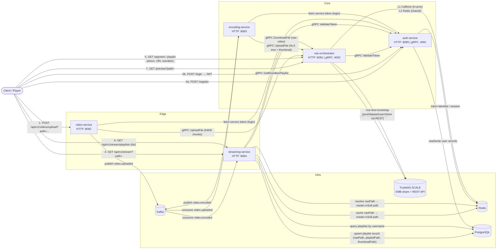

# TrueNAS Orchestrator API — PoC

A microservice-based video ingestion, transcoding, and adaptive-bitrate streaming platform for ANTAR (HEARTH), built on top of a **TrueNAS SCALE** box as the sole storage backend (no S3/object storage). Five Spring Boot services coordinate over **gRPC** (high-throughput streaming file transfers, playlist proxying & low-latency token validation), **Kafka** (async video pipeline), and **Redis** (segment cache, encoded playlist index), with **SMB/CIFS** as the actual file transport into TrueNAS and the **TrueNAS REST API** used only for one-time storage provisioning. Identity & credentials are persisted in **PostgreSQL** (one dedicated database per service that needs durable state).

---

## 1. Architecture

### 1.1 Services at a glance

| Service | HTTP Port | gRPC Port | Role | Talks to |
|---|---|---|---|---|
| **auth-service** | 8085 | 4091 | Issues & validates signed JWT bearer tokens over REST & gRPC; persists user/service identities in PostgreSQL | PostgreSQL (`antar_auth`), Redis |
| **nas-orchestrator** | 8081 | 4092 | Single gateway to TrueNAS storage: file & workspace CRUD, HLS playlist rewriting & segment cache, gRPC file-transfer server + gRPC playlist server, one-time SMB/pool/dataset/share bootstrap | TrueNAS REST API, SMB share, Redis, Caffeine (in-proc), auth-service (gRPC 4091) |
| **video-service** | 8082 | — | Accepts raw video uploads (path-scoped multipart), streams file to nas-orchestrator over gRPC, publishes `video.uploaded` | nas-orchestrator (gRPC 4092), Kafka, auth-service |
| **encoding-service** | 8083 | — | Consumes `video.uploaded`, downloads raw file & uploads multi-bitrate HLS tree + JPEG thumbnail via gRPC, publishes `video.encoded` | nas-orchestrator (gRPC 4092), Kafka, auth-service, local FFmpeg binary |
| **streaming-service** | 8084 | — | Client-facing playlist proxy (`GET /api/v1/stream`) and playlist index (`GET /api/v1/stream/playlists`); resolves path via Redis and proxies through nas-orchestrator over gRPC; persists playlist metadata (including thumbnail NAS path) in PostgreSQL; also consumes `video.encoded` to cache master playlist paths in Redis and upsert records in PostgreSQL | Redis, PostgreSQL (`antar_streaming`), nas-orchestrator (gRPC 4092), auth-service (gRPC 4091) |

Supporting infra (from `docker-compose.yml`): **Redis** (6379), **Zookeeper** (2181, Kafka dependency), **Kafka** (9092 external / 29092 internal), **PostgreSQL** (5432, single container running two logical databases provisioned at startup via `postgres-init/01-provision-databases.sh`).

### 1.2 Diagram



### 1.3 Why this shape

- **nas-orchestrator is the single gateway to TrueNAS.** Every other service reaches storage through gRPC file transfer or the gRPC playlist API — keeping SMB credentials and TrueNAS API keys confined to one process and letting that process own all caching/perf concerns (segment cache, streamed download, gRPC chunked file streaming directly to SMB).
- **High-Performance gRPC File Pipelines (`filetransfer.proto`):** File transfers between microservices (`video-service` / `encoding-service` and `nas-orchestrator`) utilise gRPC streaming over port `4092`. Files are streamed as 64KB binary `FileChunk` messages directly to SMB output streams — no buffering in HTTP multipart bodies.
- **gRPC Playlist Proxy (`streaming.proto`):** `streaming-service` proxies HLS playlist requests to `nas-orchestrator` over a dedicated unary gRPC call (`StreamingGrpcService.GetRewrittenPlaylist` on port `4092`). The caller supplies the raw NAS-relative path — no movieId indirection.
- **Low-Latency gRPC Auth Pipeline (`auth.proto`):** Protected requests to `nas-orchestrator` and `streaming-service` validate JWT tokens via high-performance binary gRPC calls (`AuthGrpcService.ValidateToken` on port `4091`) against `auth-service`, eliminating REST HTTP serialisation overhead.
- **auth-service is a JWT-issuing, PostgreSQL-backed identity store** — `POST /register` creates a user/service identity with a bcrypt-hashed password; `POST /login` verifies credentials and returns a signed HS256 JWT; `ValidateToken` (gRPC) or `GET /tokens/validate` (HTTP) is called by downstream services on protected requests. Token TTL is configurable (`AUTH_JWT_EXPIRATION_MINUTES`). Service accounts (`video-service`, `encoding-service`) are bootstrapped automatically on startup if absent.
- **video-service and encoding-service authenticate to nas-orchestrator as service identities** (`video-service`, `encoding-service`), fetching and caching their JWT from auth-service at startup (`ServiceAuthTokenProvider`) via the same `POST /login` flow.
- **Upload is plain multipart — no movieId in the URL.** `video-service` accepts `POST /api/v1/videos/upload?path=<optional-sub-path>` and scopes the destination automatically to `{username}/{path}/{filename}` on the NAS. The Kafka event carries the full NAS path so downstream services never need to re-derive it.
- **Kafka decouples upload from encoding.** `encoding-service`'s FFmpeg job can run for a long time; the consumer pauses its own container, acks the offset immediately (at-least-once, no redelivery), and processes on a dedicated worker thread so `poll()` keeps the consumer alive without a timeout risk.
- **Workspace-scoped NAS paths.** All file operations in `video-service` and `nas-orchestrator` prepend the authenticated username so users are isolated in their own directory tree (`{username}/...`). Encoded output lands under `{workspaceRoot}/encoded/{path}/{fileBaseName}/`.
- **Thumbnail generation is a best-effort step inside the encode job.** FFmpeg extracts a single JPEG frame at `t=5s` (1280×720, `-q:v 2`) as `thumbnail.jpg` alongside the HLS segments. A thumbnail failure does not abort encoding. The thumbnail NAS path is included in the `video.encoded` Kafka event and stored in the `playlists` table (`thumbnail_path` column).
- **Playlist thumbnail is served via `nas-orchestrator`'s `/preview` endpoint.** The client fetches `GET /api/v1/nas-orchestrator/files/preview?path=<thumbnailPath>` (or `GET /api/v1/nas-orchestrator/shared/preview?path=…`) using the relative path returned by `GET /api/v1/stream/playlists`. The preview endpoint streams the JPEG inline from the SMB share — no separate thumbnail CDN required.
- **Two-tier segment cache in nas-orchestrator**: Caffeine (L1, in-process, weight-bounded ~256 MB, 30 min expiry-after-access) in front of Redis (L2, 6 h TTL). On every segment fetch (hit or miss) it fires an async **N+1 prefetch** of the next `.ts` segment in the same quality ladder, using a separate bounded executor so prefetch never competes with request-serving threads.
- **Playlist URL rewriting happens once, centrally.** `nas-orchestrator` rewrites every line of every playlist it serves so variant `.m3u8` references route back to `/api/v1/nas-orchestrator/stream/playlist` and `.ts` segment references route to `/api/v1/nas-orchestrator/stream/segment` — both carrying `?token=` — so **players never talk to streaming-service more than once** after the initial request.
- **PostgreSQL provides durable persistence** for two services: `auth-service` stores user/service identities in the `users` table (`antar_auth` database, `antar_auth` role). `streaming-service` stores per-user playlist metadata in the `playlists` table (`antar_streaming` database, `antar_streaming` role). Flyway manages schema migrations in both services. A single `postgres-antar` container provisions both databases at init time via `postgres-init/01-provision-databases.sh`. Kafka's at-least-once delivery is handled idempotently via `ON CONFLICT (raw_path) DO UPDATE` in the playlist upsert query.

---

## 2. Workflow

### 2.1 Upload → Encode → Stream (end to end)

1. **Register / Login** — Client registers once via `auth-service POST /api/v1/auth-service/register`, then calls `POST /api/v1/auth-service/login` to receive a signed JWT. This JWT is passed as `X-Auth-Token` header (or `?token=` query param) on all subsequent requests.
2. **Upload** — Client calls `video-service POST /api/v1/videos/upload?path=<optional-sub-path>` (multipart `file`). `video-service` scopes the destination to `{username}/{path}/{filename}` and streams the raw video to `nas-orchestrator` over **gRPC (`FileTransferGrpcService.UploadFile`)** in 64 KB chunks. It then publishes a `VideoUploadedEvent` on Kafka topic **`video.uploaded`** (key = NAS path) carrying `workspaceRoot`, `path`, `nasPath`, `originalFileName`, and `fileSizeBytes`.
3. **Encode** — `encoding-service` consumes `video.uploaded`, pauses its Kafka container, acks, and hands the job to a single-threaded encoding worker:
   - Downloads the raw video from `nas-orchestrator` over **gRPC (`FileTransferGrpcService.DownloadFile`)** to a local temp directory.
   - Runs FFmpeg per rendition — **1080p/5000 kbps, 720p/2800 kbps, 480p/1200 kbps, 360p/800 kbps** — each to its own HLS playlist + `.ts` segments (6 s segment target, `libx264` H.264 High profile, `aac` 128 kbps audio).
   - Generates a thumbnail JPEG (`thumbnail.jpg`) at `t=5s` via FFmpeg (1280×720, best-effort — failure is non-fatal).
   - Generates a `master.m3u8` referencing all four variant playlists.
   - Streams the entire `encoded/` tree (HLS segments, variant playlists, `master.m3u8`, `thumbnail.jpg`) back to `nas-orchestrator` file-by-file over **gRPC (`FileTransferGrpcService.UploadFile`)**, landing at `{workspaceRoot}/encoded/{path}/{fileBaseName}/`.
   - Publishes `VideoEncodedEvent` (success/failure, including `thumbnailPath`) on **`video.encoded`**, then cleans up its temp directory regardless of outcome.
4. **Index** — `streaming-service` consumes `video.encoded` and, on success:
   - Caches `nasPath → {workspaceRoot}/encoded/{path}/{fileBaseName}/master.m3u8` in Redis (`streaming:playlist:{nasPath}`).
   - Upserts a `Playlist` record in PostgreSQL: `username`, `raw_path`, `playlist_path`, `thumbnail_path` (the NAS-relative path to `thumbnail.jpg`). The upsert is `ON CONFLICT (raw_path) DO UPDATE` — safe for Kafka at-least-once redelivery.
5. **Play** — Client calls `streaming-service GET /api/v1/stream?path=<nasPath>` supplying the raw file's NAS path (e.g. `sample.mp4`). `streaming-service` scopes it to `{username}/{path}`, resolves the master playlist path from Redis, then forwards it to `nas-orchestrator` via **gRPC (`StreamingGrpcService.GetRewrittenPlaylist`)**, attaching the caller's JWT per-call via gRPC metadata.
6. **Direct playback** — `nas-orchestrator` rewrites every line of every playlist it serves: variant `.m3u8` references route back to `/api/v1/nas-orchestrator/stream/playlist`, `.ts` segment references route to `/api/v1/nas-orchestrator/stream/segment` — both carrying `?token=` — so the player fetches all subsequent playlists and segments **directly from nas-orchestrator**, hitting the L1/L2 segment cache (with N+1 prefetch) on every `.ts` read.
7. **Playlist library** — Client calls `streaming-service GET /api/v1/stream/playlists`. The endpoint queries PostgreSQL for all `Playlist` rows belonging to the authenticated user and returns a list of `{ path, thumbnailUrl }` objects. `path` is the username-prefix-stripped raw NAS path (e.g. `sample.mp4`). `thumbnailUrl` is similarly stripped to a relative path (e.g. `encoded/sample/thumbnail.jpg`).
8. **Thumbnail fetch** — Client constructs the thumbnail URL using the `thumbnailUrl` value from step 7 and calls `nas-orchestrator GET /api/v1/nas-orchestrator/files/preview?path=<thumbnailUrl>` with the auth token. The preview endpoint streams the JPEG inline from the SMB share.

### 2.2 Auth flow

The auth system has moved from a simple opaque-token registry to a **password-based identity store with JWT issuance**:

- **Registration**: `POST /api/v1/auth-service/register` accepts `{ username, password, accountType? }`. The password is bcrypt-hashed and persisted alongside the identity in the `users` table (`antar_auth` PostgreSQL database). `accountType` defaults to `USER`; service identities use `SERVICE`. Username must match `^[a-zA-Z0-9._-]{1,64}$`; password must be ≥ 12 characters. Returns `201 No Content`.
- **Login**: `POST /api/v1/auth-service/login` accepts `{ username, password }`. Verifies the bcrypt hash and, on success, issues a signed **HS256 JWT** (`sub` = username, `accountType` claim, `iat` + `exp`). Token TTL is configurable via `AUTH_JWT_EXPIRATION_MINUTES`. Returns `200 { username, token }`.
- **Every protected request** to nas-orchestrator / streaming-service carries the JWT as `X-Auth-Token` header or `?token=` query parameter. A shared `TokenValidationFilter` intercepts the request and validates the token via **gRPC (`AuthGrpcService.ValidateToken`)** against `auth-service:4091`.
- **Service accounts** (`video-service`, `encoding-service`) are registered automatically at `auth-service` startup by `ServiceAccountBootstrap` (if `auth.bootstrap.enabled=true`, default). Their passwords are configured via `service.accounts.<name>.password` in the service's `.env`. They call `POST /login` at startup to obtain and cache their JWT (`ServiceAuthTokenProvider`).

### 2.3 Storage bootstrap (one-time, nas-orchestrator startup)

If `SMB_BOOTSTRAP_ENABLED=true` (default), `StorageBoostrapService` runs on nas-orchestrator startup via TrueNAS REST API:

1. Creates SMB user (`smb.username`/`smb.password`) if missing.
2. Creates ZFS pool (`antarpool`) on configured disk if missing.
3. Creates dataset (`antarpool/antar-dataset`) if missing.
4. Sets permissive (`777`) recursive permissions.
5. Creates SMB share (`antar-share`) and starts the `cifs` service.

### 2.4 PostgreSQL bootstrap (one-time, postgres container startup)

`postgres-init/01-provision-databases.sh` runs automatically when the `postgres-antar` container first initialises. It creates two isolated databases, each owned by a least-privilege role:

| Role | Database | Owned by | Used by |
|---|---|---|---|
| `antar_auth` | `antar_auth` | `antar_auth` | auth-service (Flyway + JPA) |
| `antar_streaming` | `antar_streaming` | `antar_streaming` | streaming-service (Flyway + JPA) |

Passwords for these roles are supplied via `AUTH_DB_PASSWORD` and `STREAMING_DB_PASSWORD` environment variables on the `postgres` service in `docker-compose.yml`.

**Schema management** is handled by **Flyway** inside each service at startup:

- `auth-service`: `V1__create_users_table.sql` — creates the `users` table and `idx_users_username` index.
- `streaming-service`: `V1__create_playlists_table.sql` — creates the `playlists` table and `idx_playlists_username` index.

---

## 3. API Endpoints Reference

### 3.1 `nas-orchestrator` (`:8081` HTTP / `:4092` gRPC)

#### User Files API (`/api/v1/nas-orchestrator/files`) — *Protected*

All `path` parameters are validated at the controller layer: no `..` traversal, no backslashes, no leading `/`.

| Method | Endpoint | Query / Body Params | Response | Description |
|---|---|---|---|---|
| `POST` | `/upload/file` | `path` (query, optional), `file` (multipart) | `200 FileUploadResponse` | Upload a single file into the caller's scoped workspace (`{username}/{path}/{filename}`) |
| `POST` | `/upload/folder` | `path` (query, optional), `files` (multipart array), `relativePaths` (string array) | `200 FolderUploadResponse` | Upload a directory hierarchy into the caller's workspace |
| `POST` | `/mkdir` | `path` (query, **required**) | `201 CreateFolderResponse` | Create a folder (and any intermediate directories) inside the caller's scoped workspace |
| `GET` | `/download` | `path` (query) | `200` (streamed binary) | Stream-download a file from the caller's workspace |
| `GET` | `/preview` | `path` (query) | `200` (inline media) / `415` if not previewable | Stream-preview an inline media or text file from the caller's workspace. **Used by clients to load playlist thumbnails** — pass the `thumbnailUrl` from `GET /api/v1/stream/playlists` as the `path` parameter |
| `GET` | `/list` | `path` (query, optional) | `200 FileListResponse` | List files and folders in the caller's workspace directory |
| `DELETE` | `/delete` | `path` (query) | `204 No Content` | Delete a file or directory from the caller's workspace |

#### Shared Workspace API (`/api/v1/nas-orchestrator/shared`) — *Protected*

All `path` parameters are validated at the controller layer: no `..` traversal, no backslashes, no leading `/`. The shared workspace is **not** username-scoped — all authenticated users share a single root directory.

| Method | Endpoint | Query / Body Params | Response | Description |
|---|---|---|---|---|
| `GET` | `/list` | `path` (query, optional) | `200 FileListResponse` | List files and folders in the shared workspace |
| `POST` | `/upload/file` | `path` (query, optional), `file` (multipart) | `200 FileUploadResponse` | Upload a single file into the shared workspace |
| `POST` | `/upload/folder` | `path` (query, optional), `files` (multipart array), `relativePaths` (string array) | `200 FolderUploadResponse` | Upload a folder hierarchy into the shared workspace |
| `POST` | `/mkdir` | `path` (query, **required**) | `201 CreateFolderResponse` | Create a folder (and any intermediate directories) inside the shared workspace |
| `GET` | `/download` | `path` (query) | `200` (streamed binary) | Stream-download a file from the shared workspace |
| `GET` | `/preview` | `path` (query) | `200` (inline media) / `415` if not previewable | Preview an inline file in the shared workspace |
| `DELETE` | `/delete` | `path` (query) | `204 No Content` | Delete a file or folder from the shared workspace |
| `DELETE` | `/clear` | — | `204 No Content` | Purge **all** files in the shared workspace |

#### Workspace Management API (`/api/v1/nas-orchestrator/workspace`) — *Protected*
| Method | Endpoint | Body Params | Description |
|---|---|---|---|
| `POST` | `/create` | JSON `{ "name": "workspace_name" }` | Provision an isolated workspace folder for a user |
| `DELETE` | `/delete` | — | Delete the calling user's root workspace directory |
| `DELETE` | `/clear` | — | Clear all contents inside the calling user's workspace directory |

#### HLS Streaming API (`/api/v1/nas-orchestrator/stream`) — *Token via query param*
| Method | Endpoint | Query Params | Description |
|---|---|---|---|
| `GET` | `/playlist` | `path` (required), `token` (optional) | Fetch and rewrite HLS playlist (`.m3u8`) with self-referencing absolute URLs pointing back to `/stream/playlist` and `/stream/segment` |
| `GET` | `/segment` | `path` (required) | Stream `.ts` HLS video segment backed by L1 Caffeine / L2 Redis cache + async N+1 prefetch |

#### System & Health
| Method | Endpoint | Description |
|---|---|---|
| `GET` | `/api/v1/nas-orchestrator/health` | Health check endpoint |

#### gRPC Services (port `:4092`)
| Service | RPC Method | Type | Description |
|---|---|---|---|
| `FileTransferGrpcService` | `UploadFile` | Client Streaming (`stream FileChunk → UploadResponse`) | Streams binary 64 KB file chunks directly into SMB destination; first chunk carries `destination_path` |
| `FileTransferGrpcService` | `DownloadFile` | Server Streaming (`DownloadRequest → stream FileChunk`) | Streams binary 64 KB file chunks from SMB storage |
| `StreamingGrpcService` | `GetRewrittenPlaylist` | Unary (`PlaylistRequest → PlaylistResponse`) | Reads `.m3u8` from SMB, rewrites all playlist/segment URIs to self-referencing nas-orchestrator URLs, returns raw M3U8 string |

---

### 3.2 `auth-service` (`:8085` HTTP / `:4091` gRPC)

| Method | Endpoint | Request Body / Query | Response | Description |
|---|---|---|---|---|
| `POST` | `/api/v1/auth-service/register` | JSON `{ "username": "alice", "password": "...", "accountType": "USER" }` | `201 No Content` | Register a new user or service identity. `accountType` defaults to `USER` if omitted. Username: `^[a-zA-Z0-9._-]{1,64}$`. Password: ≥ 12 chars. Returns `409` if username already exists |
| `POST` | `/api/v1/auth-service/login` | JSON `{ "username": "alice", "password": "..." }` | `200 { "username": "alice", "token": "<jwt>" }` | Authenticate and receive a signed JWT. Returns `401` on bad credentials |
| `GET` | `/api/v1/auth-service/tokens/validate` | `token` (query) | `200 { "username": "alice" }` | Validate a JWT over HTTP REST; returns the subject username on success |
| `GET` | `/api/v1/auth-service/health` | — | `200` | Health check endpoint |

#### gRPC Services (`AuthGrpcService` on port `:4091`)
| RPC Method | Type | Description |
|---|---|---|
| `ValidateToken` | Unary (`ValidateTokenRequest → ValidateTokenResponse`) | Validates a JWT; returns `valid` flag + `username` |

#### PostgreSQL schema (`antar_auth` database)

```sql
-- Managed by Flyway (V1__create_users_table.sql)
CREATE TABLE users (
    id            BIGSERIAL PRIMARY KEY,
    username      VARCHAR(64)  NOT NULL UNIQUE,
    password_hash VARCHAR(255) NOT NULL,          -- bcrypt hash
    account_type  VARCHAR(16)  NOT NULL DEFAULT 'USER',  -- USER | SERVICE
    created_at    TIMESTAMPTZ  NOT NULL DEFAULT now(),
    updated_at    TIMESTAMPTZ  NOT NULL DEFAULT now()
);
CREATE INDEX idx_users_username ON users (username);
```

---

### 3.3 `video-service` (`:8082` HTTP) — *Protected*

| Method | Endpoint | Request Params | Description |
|---|---|---|---|
| `POST` | `/api/v1/videos/upload` | `path` (query, optional), `file` (multipart) | Upload raw video; destination scoped to `{username}/{path}/{filename}` on NAS via gRPC; triggers Kafka `video.uploaded` event |

**Response body:** `"video uploaded successfully! Key = {nasPath} : Encoding started automatically via Kafka"`

**Kafka event published** (`video.uploaded`, key = `nasPath`):

| Field | Type | Description |
|---|---|---|
| `workspaceRoot` | String | Authenticated username (workspace root directory) |
| `path` | String | Optional sub-path supplied by client |
| `nasPath` | String | Full NAS-relative path the file was written to (`{username}/{path}/{filename}`) |
| `originalFileName` | String | Original filename from the multipart upload |
| `fileSizeBytes` | long | File size in bytes |

---

### 3.4 `encoding-service` (`:8083` HTTP) — *No HTTP endpoints*

`encoding-service` exposes no HTTP API. It operates purely as a Kafka consumer.

**Kafka event consumed** (`video.uploaded`, group `encoding-service-group`):

Encoding pipeline per consumed event:
1. Downloads raw file from NAS via gRPC `DownloadFile` to local temp dir
2. FFmpeg encodes to **4 renditions**: 1080p/5000 kbps, 720p/2800 kbps, 480p/1200 kbps, 360p/800 kbps (H.264 High profile + AAC 128 kbps, **6 s** HLS segments)
3. Generates `master.m3u8` referencing all four variant playlists
4. Generates `thumbnail.jpg` — single JPEG frame at `t=5s`, 1280×720, FFmpeg `-q:v 2` (best-effort; failure is logged but does not abort the job)
5. Uploads entire encoded tree (HLS segments, variant playlists, `master.m3u8`, `thumbnail.jpg`) to NAS via gRPC `UploadFile` under `{workspaceRoot}/encoded/{path}/{fileBaseName}/`
6. Publishes `VideoEncodedEvent` on `video.encoded`
7. Cleans up local temp directory

**Kafka event published** (`video.encoded`, key = `nasPath`):

| Field | Type | Description |
|---|---|---|
| `workspaceRoot` | String | Authenticated username (workspace root directory) |
| `nasPath` | String | NAS path of the original raw file (Kafka message key) |
| `masterPlaylistPath` | String | NAS-relative path to `master.m3u8` (null on failure) |
| `thumbnailPath` | String | NAS-relative path to `thumbnail.jpg` (null on failure or if thumbnail generation failed) |
| `success` | boolean | Whether encoding completed successfully |
| `errorMessage` | String | Error description (null on success) |

---

### 3.5 `streaming-service` (`:8084` HTTP) — *Protected*

| Method | Endpoint | Query / Header Params | Response | Description |
|---|---|---|---|---|
| `GET` | `/api/v1/stream` | `path` (required), `X-Auth-Token` (header) or `token` (query) | `200 text/x-mpegURL` | Resolve master playlist from Redis by scoped NAS path, then proxy the rewritten M3U8 through nas-orchestrator via gRPC |
| `GET` | `/api/v1/stream/playlists` | `X-Auth-Token` (header) or `token` (query) | `200 List<PlaylistDto>` | Return all playlists (and their thumbnail paths) indexed for the authenticated user, sourced from PostgreSQL |

#### `GET /api/v1/stream` — request flow

1. Client supplies `?path=<nasPath>` — the raw NAS path of the uploaded file (e.g. `sample.mp4`, the same value used as the Kafka key in `video.uploaded`).
2. Controller scopes it: `{username}/{path}` → e.g. `alice/sample.mp4`.
3. Looks up `streaming:playlist:alice/sample.mp4` in Redis → resolves to the master playlist path e.g. `alice/encoded/sample/master.m3u8`.
4. Returns `404` if no playlist is registered yet (encoding not complete).
5. Calls `nas-orchestrator` via **gRPC `StreamingGrpcService.GetRewrittenPlaylist`**, forwarding the resolved path and the caller's JWT per-call via gRPC metadata (`x-auth-token`).
6. Returns the rewritten M3U8 — all segment and sub-playlist URLs point directly at `nas-orchestrator`, so the player never hits `streaming-service` again.

- Path is validated: no `..` traversal, no backslashes, no leading `/`.

#### `GET /api/v1/stream/playlists` — response

Returns a JSON array of `PlaylistDto` objects sourced from the `playlists` table in PostgreSQL. The username prefix is stripped from both `path` and `thumbnailUrl` before returning.

```json
[
  {
    "path": "sample.mp4",
    "thumbnailUrl": "encoded/sample/thumbnail.jpg"
  },
  {
    "path": "subfolder/movie.mp4",
    "thumbnailUrl": "encoded/subfolder/movie/thumbnail.jpg"
  }
]
```

To display the thumbnail in the client, fetch it from nas-orchestrator using the `thumbnailUrl` value:

```
GET /api/v1/nas-orchestrator/files/preview?path=<thumbnailUrl>
X-Auth-Token: <jwt>
```

#### Redis index (written by Kafka consumer on `video.encoded`)
- Key: `streaming:playlist:{workspaceRoot}/{path}` (e.g. `streaming:playlist:alice/sample.mp4`)
- Value: NAS-relative path to `master.m3u8` (e.g. `alice/encoded/sample/master.m3u8`)
- Written when a successful `video.encoded` event is consumed from Kafka topic `video.encoded` (group `streaming-service-group`)

#### PostgreSQL schema (`antar_streaming` database)

```sql
-- Managed by Flyway (V1__create_playlists_table.sql)
CREATE TABLE playlists (
    id             BIGSERIAL PRIMARY KEY,
    username       VARCHAR(64)  NOT NULL,
    raw_path       VARCHAR(255) NOT NULL UNIQUE,   -- full NAS path e.g. alice/sample.mp4
    playlist_path  VARCHAR(255) NOT NULL UNIQUE,   -- e.g. alice/encoded/sample/master.m3u8
    thumbnail_path VARCHAR(255),                   -- e.g. alice/encoded/sample/thumbnail.jpg
    created_at     TIMESTAMPTZ  NOT NULL DEFAULT now(),
    updated_at     TIMESTAMPTZ  NOT NULL DEFAULT now()
);
CREATE INDEX idx_playlists_username ON playlists (username);
```

Rows are upserted atomically on successful `video.encoded` events:

```sql
INSERT INTO playlists (username, raw_path, playlist_path, thumbnail_path, created_at, updated_at)
VALUES (:username, :rawPath, :playlistPath, :thumbnailPath, now(), now())
ON CONFLICT (raw_path)
DO UPDATE SET playlist_path = EXCLUDED.playlist_path,
              thumbnail_path = EXCLUDED.thumbnail_path,
              updated_at = now();
```

---

## 4. Repository layout

```
TrueNAS-Orchestrator-API-PoC/
├── docker-compose.yml        # redis, zookeeper, kafka, postgres + all 5 microservices
├── postgres-init/            # 01-provision-databases.sh — creates antar_auth + antar_streaming DBs at first run
├── proto/                    # Protobuf definitions (auth.proto, filetransfer.proto, streaming.proto)
├── auth-service/             # JWT issue/validate REST & gRPC server; PostgreSQL identity store (port 8085 / 4091)
├── nas-orchestrator/         # SMB/TrueNAS gateway, HLS proxy, file CRUD, gRPC server (port 8081 / 4092)
├── video-service/            # upload intake, gRPC client, kafka producer (port 8082)
├── encoding-service/         # kafka consumer, ffmpeg HLS encode + thumbnail, gRPC client (port 8083)
└── streaming-service/        # kafka consumer (index + postgres upsert), gRPC playlist proxy, playlist library API (port 8084)
```

---

## 5. Bootstrap steps

### 5.1 Prerequisites

- Docker + Docker Compose v2
- A reachable **TrueNAS SCALE** instance with:
  - An unused/blank disk for ZFS pool creation (or pre-provisioned share with `SMB_BOOTSTRAP_ENABLED=false`).
  - TrueNAS API key with pool/dataset/share/user permissions.
- Ports free on host: `5432, 6379, 9092, 4091, 4092, 8081-8085`.

### 5.2 Clone & Configure `.env`

```bash
git clone https://github.com/ANTAR-Project/TrueNAS-Orchestrator-API-PoC.git
cd TrueNAS-Orchestrator-API-PoC
```

Ensure `./root.env` and `./\<service\>/.env` files exist for all services before starting. The root `.env` (loaded by `docker-compose.yml`) must provide at minimum:

```dotenv
POSTGRES_SUPERUSER_PASSWORD=...   # bootstrap-only; no app connects as this role
AUTH_DB_PASSWORD=...              # password for the antar_auth role
STREAMING_DB_PASSWORD=...         # password for the antar_streaming role
```

### 5.3 Bring the stack up

```bash
docker compose up --build -d
```

PostgreSQL will initialise first; the `auth-service` container depends on the `postgres` healthcheck before starting.

### 5.4 Verify

```bash
curl http://localhost:8085/api/v1/auth-service/health
curl http://localhost:8081/api/v1/nas-orchestrator/health
```

Register a user and test the full pipeline:

```bash
# Register
curl -s -X POST http://localhost:8085/api/v1/auth-service/register \
  -H 'Content-Type: application/json' \
  -d '{"username":"tester","password":"supersecret123"}'

# Login → get JWT
TOKEN=$(curl -s -X POST http://localhost:8085/api/v1/auth-service/login \
  -H 'Content-Type: application/json' \
  -d '{"username":"tester","password":"supersecret123"}' | jq -r .token)

# Upload a raw video (path is optional, scoped to your workspace automatically)
curl -X POST "http://localhost:8082/api/v1/videos/upload" \
  -H "X-Auth-Token: $TOKEN" \
  -F "file=@/path/to/sample.mp4"
# → returns: "video uploaded successfully! Key = tester/sample.mp4 : Encoding started automatically via Kafka"
```

Once `video.encoded` finishes on Kafka (master playlist path is stored in Redis + PostgreSQL), stream directly by path:

```bash
# Stream the master playlist (returns rewritten M3U8)
curl "http://localhost:8084/api/v1/stream?path=sample.mp4&token=$TOKEN"

# List all indexed playlists for the authenticated user (from PostgreSQL)
curl "http://localhost:8084/api/v1/stream/playlists" -H "X-Auth-Token: $TOKEN"
# → [{"path":"sample.mp4","thumbnailUrl":"encoded/sample/thumbnail.jpg"}]

# Fetch the thumbnail via nas-orchestrator /preview
curl "http://localhost:8081/api/v1/nas-orchestrator/files/preview?path=encoded/sample/thumbnail.jpg" \
  -H "X-Auth-Token: $TOKEN" \
  --output thumbnail.jpg
```

---

## 6. Points to Consider

- **No TLS anywhere** — inter-service REST/gRPC calls, SMB, and TrueNAS API calls are plaintext in this PoC.
- **JWT secret must be kept secure** — `auth.jwt.secret` is a Base64-encoded HMAC key. Rotating it invalidates all active tokens. No key rotation mechanism is implemented in this PoC.
- **`depends_on` in compose is startup-order only** — retries are implemented within clients for Redis/Kafka/gRPC. The `postgres` service uses a `healthcheck` so `auth-service` and `streaming-service` wait for it to be ready before starting.
- **No horizontal-scaling story for encoding-service** — one encode at a time *per instance* (single-thread executor + paused consumer), and FFmpeg jobs are bounded at **30 min per rendition** (forcibly killed on timeout).
- **Redis playlist index is required for playback** — `streaming-service` resolves `streaming:playlist:{scopedNasPath}` from Redis on every `GET /api/v1/stream` request. If the key is missing (encoding not yet complete or failed), the endpoint returns `404`. The PostgreSQL-backed `GET /api/v1/stream/playlists` list endpoint is independent of Redis and shows all successfully encoded playlists that have been persisted.
- **Thumbnail is best-effort** — if FFmpeg thumbnail generation fails, `thumbnailPath` in the `VideoEncodedEvent` and in the database will be `null`. The client should handle a `null` `thumbnailUrl` in the `GET /api/v1/stream/playlists` response gracefully.
- **Playlist upsert is idempotent** — the `ON CONFLICT (raw_path) DO UPDATE` query in `PlaylistRepository` means re-delivering a `video.encoded` Kafka event (at-least-once) will update rather than duplicate the playlist record.
