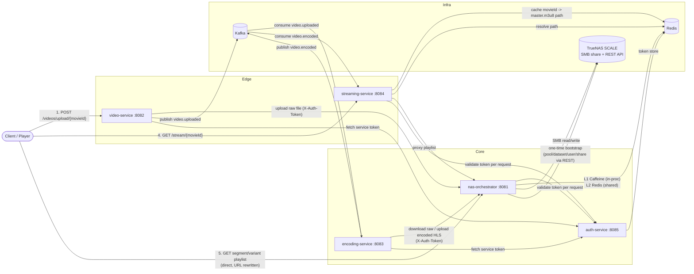

# TrueNAS Orchestrator API — PoC

A microservice-based video ingestion, transcoding, and adaptive-bitrate streaming platform for ANTAR (HEARTH), built on top of a **TrueNAS SCALE** box as the sole storage backend (no S3/object storage). Five Spring Boot services coordinate over **Kafka** (async video pipeline) and **Redis** (auth tokens, segment cache, playlist index), with **SMB/CIFS** as the actual file transport into TrueNAS and the **TrueNAS REST API** used only for one-time storage provisioning.

---

## 1. Architecture

### 1.1 Services at a glance

| Service | Port | Role | Talks to |
|---|---|---|---|
| **auth-service** | 8085 | Issues & validates opaque bearer tokens (service-to-service and client) | Redis |
| **nas-orchestrator** | 8081 | Single gateway to TrueNAS storage: file CRUD, HLS playlist rewriting, segment cache, one-time SMB/pool/dataset/share bootstrap | TrueNAS REST API, SMB share, Redis, Caffeine (in-proc), auth-service |
| **video-service** | 8082 | Accepts raw video uploads, stores raw file via nas-orchestrator, publishes `video.uploaded` | nas-orchestrator, Kafka, auth-service |
| **encoding-service** | 8083 | Consumes `video.uploaded`, runs FFmpeg → multi-bitrate HLS, uploads encoded output via nas-orchestrator, publishes `video.encoded` | nas-orchestrator, Kafka, auth-service, local FFmpeg binary |
| **streaming-service** | 8084 | Client-facing playlist entry point (`/api/v1/stream/{movieId}`); resolves movie → master playlist path from Redis, proxies through nas-orchestrator | Redis, nas-orchestrator, auth-service |

Supporting infra (from `docker-compose.yml`): **Redis** (6379), **Zookeeper** (2181, Kafka dependency), **Kafka** (9092 external / 29092 internal).

### 1.2 Diagram



### 1.3 Why this shape

- **nas-orchestrator is the only service that touches TrueNAS.** Every other service reaches storage indirectly through its HTTP API — this keeps SMB credentials and TrueNAS API keys confined to one process and lets that process own caching/perf concerns (segment cache, streamed zip/download, multipart-to-disk uploads).
- **auth-service is a minimal, Redis-backed opaque token issuer** — not OAuth/JWT. `POST /tokens` mints a token and evicts any previous token for that identity (single active token per username); `GET /tokens/validate` is called by every other service on (almost) every request via a shared `TokenValidationFilter`/`AuthClient` pattern. Each downstream service distinguishes "token invalid" (401) from "auth-service unreachable" (503).
- **video-service and encoding-service authenticate to nas-orchestrator as service identities** (`video-service`, `encoding-service`), fetching and caching their own token from auth-service at startup (`ServiceAuthTokenProvider`, lazy re-fetch on first use if startup registration fails).
- **Kafka decouples upload from encoding.** `encoding-service`'s FFmpeg job can run for a long time; the consumer pauses its own container, acks the offset immediately (at-least-once, no redelivery), and processes on a dedicated worker thread so `poll()` keeps the consumer alive without a timeout risk.
- **Two-tier segment cache in nas-orchestrator**: Caffeine (L1, in-process, weight-bounded ~256MB, 30 min expiry-after-access) in front of Redis (L2, 6h TTL). On every segment fetch (hit or miss) it fires an async **N+1 prefetch** of the next `.ts` segment in the same quality ladder, using a separate bounded executor so prefetch never competes with request-serving threads.
- **Playlist URL rewriting happens once, centrally.** `nas-orchestrator` rewrites `.m3u8` files it serves so that every playlist and segment reference points back at its own `/stream/playlist` and `/stream/segment` endpoints (carrying the auth token as a query param). This means **players never talk to streaming-service more than once** — the first playlist fetch resolves everything else directly against nas-orchestrator.

---

## 2. Workflow

### 2.1 Upload → Encode → Stream (end to end)

1. **Upload** — Client calls `video-service POST /api/v1/videos/upload/{movieId}` (multipart). video-service streams the file to `nas-orchestrator` under `raw/{movieId}/{originalFilename}` (authenticated with its own service token), then publishes a `VideoUploadedEvent` on Kafka topic **`video.uploaded`** (key = movieId).
2. **Encode** — `encoding-service` consumes `video.uploaded`, pauses its Kafka container, acks, and hands the job to a single-threaded encoding worker (one encode at a time per instance):
   - Downloads the raw file from nas-orchestrator to local temp storage.
   - Runs FFmpeg per rendition — **1080p/5000kbps, 720p/2800kbps, 480p/1200kbps, 360p/800kbps** — each to its own HLS playlist + `.ts` segments (10s segment target).
   - Generates a `master.m3u8` referencing all four variant playlists.
   - Uploads the whole `encoded/{movieId}/` tree back to nas-orchestrator **one file per HTTP POST** (mirrors the old S3-PUT-per-object model; avoids buffering an entire HLS tree into one multipart body).
   - Publishes `VideoEncodedEvent` (success/failure) on **`video.encoded`**, then cleans up its temp directory regardless of outcome.
3. **Index** — `streaming-service` consumes `video.encoded` and, on success, caches `movieId → encoded/{movieId}/master.m3u8` in Redis (`streaming:playlist:{movieId}`).
4. **Play** — Client calls `streaming-service GET /api/v1/stream/{movieId}`. It resolves the master playlist path from Redis and proxies the raw M3U8 from `nas-orchestrator GET /stream/playlist`.
5. **Direct playback** — `nas-orchestrator` rewrites every line of every playlist it serves: variant `.m3u8` references route back to its own `/stream/playlist`, `.ts` segment references route to `/stream/segment` — both carrying `?token=` — so the player fetches all subsequent playlists and segments **directly from nas-orchestrator**, hitting the L1/L2 segment cache (with N+1 prefetch) on every `.ts` read.

### 2.2 Auth flow

- **Human/service identity registration**: `POST /api/v1/auth-service/tokens {username}` → Redis stores `auth:token:{token} → username` and `auth:user:{username} → token` (re-issuing invalidates the previous token for that identity). TTL is configurable (`AUTH_TOKEN_TTL_HOURS`, default `0` = no expiry — PoC convenience, not production-safe).
- **Every protected request** to nas-orchestrator / streaming-service carries `X-Auth-Token` (header) or `?token=` (query, used for playlist/segment URLs since `<video>`/HLS players can't set custom headers). A shared `TokenValidationFilter` resolves the token, calls `auth-service GET /tokens/validate`, and either attaches the resolved username to the request (`authUsername` attribute + SLF4J MDC) or short-circuits with `401` (invalid/missing token) or `503` (auth-service unreachable). `/health` and `/actuator/**` bypass the filter.
- **video-service / encoding-service** are themselves auth-service clients: `ServiceAuthTokenProvider` registers a fixed service identity (`video-service`, `encoding-service`) at startup and caches the token in memory for the life of the process, re-fetching lazily if startup registration failed.

### 2.3 Storage bootstrap (one-time, nas-orchestrator startup)

If `SMB_BOOTSTRAP_ENABLED=true` (default), `StorageBoostrapService` runs on nas-orchestrator startup and, via the TrueNAS REST API (with transparent async-job polling — TrueNAS returns a job ID for long-running calls, which is polled every second for up to 60s):

1. Creates the SMB user (`smb.username`/`smb.password`) if it doesn't exist.
2. Creates a ZFS pool (`antarpool`) on the configured disk if it doesn't exist.
3. Creates a dataset (`antarpool/antar-dataset`) if it doesn't exist.
4. Sets permissive (`777`) recursive permissions on the dataset.
5. Creates an SMB share over that dataset if it doesn't exist, and starts the `cifs` service.

Every step is existence-checked first, so this is safe to leave enabled across restarts — it's idempotent, not a one-shot migration.

---

## 3. Repository layout

```
TrueNAS-Orchestrator-API-PoC/
├── docker-compose.yml        # redis, zookeeper, kafka + all 5 services
├── auth-service/             # token issue/validate, Redis-backed
├── nas-orchestrator/         # SMB/TrueNAS gateway, HLS proxy, segment cache, bootstrap
├── video-service/            # upload intake, kafka producer
├── encoding-service/         # kafka consumer, ffmpeg HLS encode, kafka producer
└── streaming-service/        # kafka consumer (index), playlist proxy
```

Each service is an independent Maven (`mvnw`) Spring Boot 4.1.1 / Java 21 project with its own `Dockerfile` (multi-stage: `maven:3.9.9-eclipse-temurin-21` build → `eclipse-temurin:21-jdk` runtime) and its own `.env` (git-ignored, referenced via `env_file:` in compose).

---

## 4. Bootstrap steps

### 4.1 Prerequisites

- Docker + Docker Compose v2
- A reachable **TrueNAS SCALE** instance with:
  - An unused/blank disk you're willing to hand to a new ZFS pool (or set `SMB_BOOTSTRAP_ENABLED=false` and provision the pool/dataset/share/user yourself, pointing config at the existing share).
  - An API key (TrueNAS UI → API Keys) for a user with permission to manage pools, datasets, shares, users, and services.
- FFmpeg is **not** needed on your host — it runs inside the `encoding-service` container (ensure the image/base has `ffmpeg` on `PATH`, or set `FFMPEG_PATH` to a binary you mount in).
- Ports free on the host: `6379, 9092, 8081-8085`.

### 4.2 Clone

```bash
git clone https://github.com/ANTAR-Project/TrueNAS-Orchestrator-API-PoC.git
cd TrueNAS-Orchestrator-API-PoC
```

### 4.3 Create each service's `.env`

`docker-compose.yml` requires `./<service>/.env` to **exist** for every service (even if empty) — create all five before running `docker compose up`.

**`nas-orchestrator/.env`**
```env
TRUENAS_BASE_URL=https://<truenas-host>
TRUENAS_API_KEY=<truenas-api-key>

SMB_USERNAME=antar-orchestrator
SMB_PASSWORD=<choose-a-strong-password>
SMB_SHARE_BASE_URL=smb://<truenas-host>/antar-share/

# Optional — defaults shown
SMB_BOOTSTRAP_ENABLED=true
SMB_BOOTSTRAP_DISK_IDENTIFIER=<disk-id-from-truenas, e.g. sdb>
CORS_ALLOWED_ORIGINS=http://localhost:5501
AUTH_SERVICE_BASE_URL=http://auth-service:8085
```
> `SMB_SHARE_BASE_URL` must match the share bootstrap will create (`antar-share`, on dataset `antarpool/antar-dataset`) — or your pre-existing share if bootstrap is disabled.

**`auth-service/.env`**
```env
# Optional — defaults shown
AUTH_TOKEN_TTL_HOURS=0
CORS_ALLOWED_ORIGINS=http://localhost:5173
```

**`video-service/.env`**
```env
# Optional
CORS_ALLOWED_ORIGINS=http://localhost:5501
```

**`encoding-service/.env`**
```env
# Optional — defaults shown
FFMPEG_PATH=ffmpeg
TEMP_DIR=/tmp/encoding
```

**`streaming-service/.env`**
```env
# Optional
CORS_ALLOWED_ORIGINS=http://localhost:5501
```

### 4.4 Bring the stack up

```bash
docker compose up --build -d
```

This builds all 5 service images and starts Zookeeper → Kafka → Redis → `auth-service` → `nas-orchestrator` → `video-service`/`encoding-service` → `streaming-service` (per `depends_on`, though these are startup-order hints only, not readiness gates — see [Points to Consider](#points-to-consider)).

Watch nas-orchestrator's logs for the bootstrap sequence:
```bash
docker compose logs -f nas-orchestrator
```
You should see `Baseline SMB storage provisioned: user=..., pool=..., dataset=..., share=...` once TrueNAS provisioning succeeds.

### 4.5 Verify

```bash
curl http://localhost:8085/api/v1/auth-service/health 2>/dev/null; echo
curl http://localhost:8081/api/v1/nas-orchestrator/health
```

Get a token and try an upload:
```bash
TOKEN=$(curl -s -X POST http://localhost:8085/api/v1/auth-service/tokens \
  -H 'Content-Type: application/json' -d '{"username":"tester"}' | jq -r .token)

curl -X POST "http://localhost:8082/api/v1/videos/upload/movie-001" \
  -H "X-Auth-Token: $TOKEN" \
  -F "file=@/path/to/sample.mp4"
```

Then poll Kafka/logs for `video.encoded`, and once it's published:
```bash
curl "http://localhost:8084/api/v1/stream/movie-001?token=$TOKEN"
```
which should return a rewritten master `.m3u8` pointing back at `nas-orchestrator:8081`.

---

## 5. Points to Consider

- **No TLS anywhere** — inter-service calls, SMB, and the TrueNAS API call are all plaintext/unencrypted by default in this compose setup.
- **Tokens don't expire by default** (`AUTH_TOKEN_TTL_HOURS=0`) and are stored as plain opaque strings in Redis with no revocation UI.
- **`depends_on` in compose is startup-order only**, not a health check — services can start before Redis/Kafka/auth-service are actually accepting connections; retry/backoff is minimal.
- **No horizontal-scaling story for encoding-service** — one encode at a time *per instance* (single-thread executor + paused consumer), and FFmpeg jobs are unbounded in duration with no timeout/kill logic.